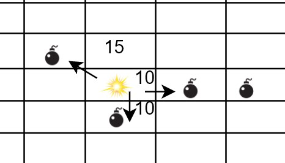
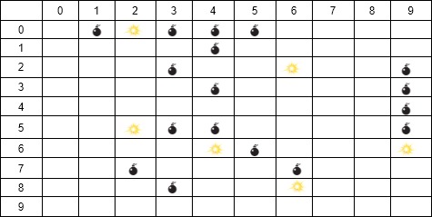
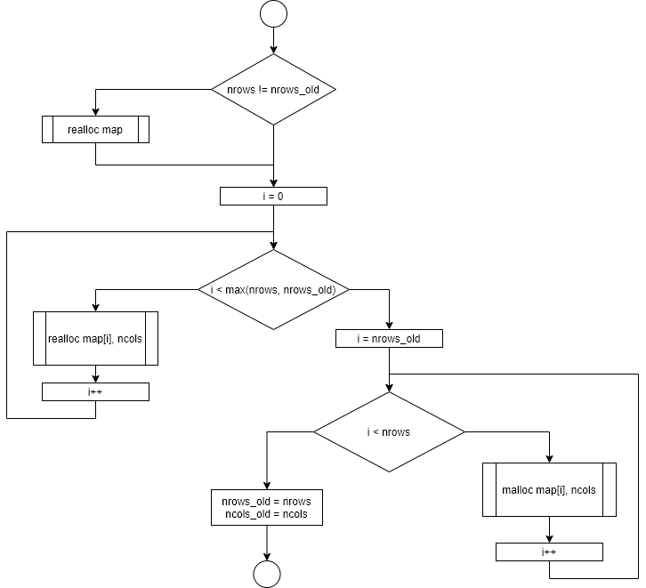
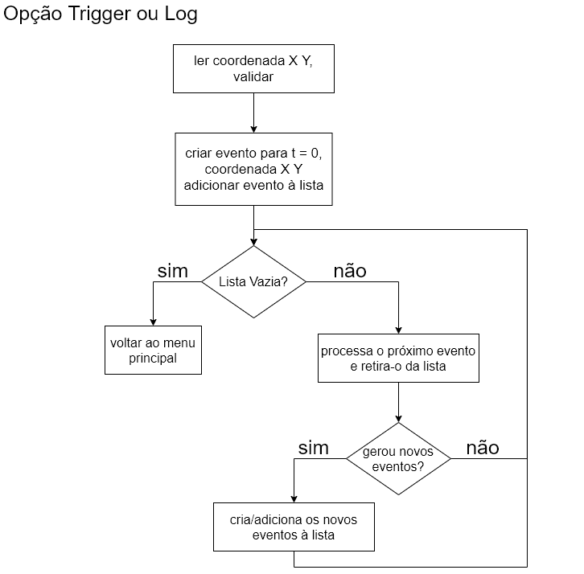

**UNIVERSIDADE LUSÓFONA DE HUMANIDADES E TECNOLOGIAS**

* 2020/2021*

# Projecto Final - BombRoad

# 1. Introdução

## 1.1 Recomendações

Na resolução deste projecto deve ser utilizada a Linguagem de Programação C. Para além da correta implementação dos requisitos, tenha em conta os seguintes aspetos:
- O código apresentado deve estar *bem indentado*. 
- O código deve compilar sem erros ou *warnings* utilizando o *gcc* com as seguintes flags:
 `-Wall -Wextra -Wpedantic -ansi`
- Tenha em atenção os nomes dados das variáveis, para que sejam indicadores daquilo que as mesmas vão conter.
- Evite o uso de constantes mágicas. 
- Evite duplicação de código. 
- Considere a implementação de funções para melhorar a legibilidade, evitar a duplicação e criar soluções mais genéricas.
- É proíbida a utilização de variáveis globais - i.e. variáveis declaradas fora de qualquer função.
- Este trabalho poderá ser realizado individualmente ou em grupos com o máximo de 2 alunos. Os grupos têm **obrigatoriamente** de ser os mesmos grupos do MiniProjecto.

Para a realização deste projecto, os alunos deverão adquirir as seguintes competências:
- Manipulação de ficheiros
- Vectores e matrizes
- Strings
- Ciclos
- Condições
- Argumentos do main
- Estruturas
- Memória Dinâmica
- git
- Trabalho em grupo

## 1.2 Descrição

No mini projecto, construiu-se um programa que constroi um mapa de bombas em determinadas coordenadas (X, Y) de um tabuleiro. As bombas podem ter dois estados, armed ou off.

Pretende agora desenvolver-se um simulador capaz de calcular a propagação da explosão das bombas considerando a distância entre elas.

Após o carregamento/construção do mapa, se o utilizador escolher a opção "trigger", a bomba seleccionada deverá explodir. Essa explosão será propagada para as bombas adjacentes e fará com que estas também explodam:

* As bombas que estiverem à distancia de 1 casa em X ou Y irão rebentar 10ms depois.

* As bombas que estiverem nas casas diagonais irão rebentar 15ms depois

  

Essas bombas irão por sua vez gerar novas explosões.

Depedentendo da opção escolhida pelo utilizador, o programa deverá apresentar, a cada explosão, o mapa completo, ou em alternativa deverá apresentar o tempo e a coordenada da bomba que explodiu. Para este efeito o comando trigger implementado no MiniProjecto dará lugar a dois comandos:

trigger <x> <y> - com esta opção se houver uma bomba na coordenada especificada irá explodir e desencadear explosões sucessivas nas bombas adjacentes até que não haja mais bombas adjacentes. O programa para cada explosão deverá mostrar o mapa no ecrã. Ver exemplos de funcionamento.

log <x> <y> - com esta opção se houver uma bomba na coordenada especificada irá explodir e desencadear explosões sucessivas nas bombas adjacentes até que não haja mais bombas adjacentes. O programa para cada explosão deverá mostrar no ecrã o tempo e a coordenada da bomba que explodiu. Ver exemplos de funcionamento.


# 2 Implementação

O programa deverá ser capaz de ler um ficheiro de configuração contendo o mapa com a localização de uma série de minas, e deverá fornecer ao utilizador uma interface para fazer alterações ao mapa - adicionar novas minas ou explodir uma mina existente. As explosões irão desencadear explosões das minas que estiverem em qualquer das 8 posições adjacentes. 

Cada posição no mapa representa-se por duas coordenadas (X, Y). Estas coordenadas são valores inteiros e, nesta segunda fase *não há limite superior para o tamanho do tabuleiro*. O mapa deverá ser criado na zona de memória dinâmica.

Cada uma das coordenadas do mapa poderá estar vazia (sem mina) ou ter uma mina. Cada mina poderá assumir apenas 2 estados, ou armed ou off (armada ou rebentada). 



## 2.1 Menu

O programa deverá começar por apresentar o seguinte menu:

```
+-----------------------------------------------------
read <filename>     - read input file
show                - show the mine map
trigger <x> <y>     - trigger mine at <x> <y>
log <x> <y>			- trigger mine at <x> <y>
plant <x> <y>       - place armed mine at <x> <y>
export <filename>   - save file with current map
quit                - exit program
sos                 - show menu
+-----------------------------------------------------
```

Sempre que o programa estiver à espera que o utilizador introduza um input, deverá imprimir, numa linha isolada, o caracter `>` - ver exemplo. Se o utilizador introduzir um input inválido o programa deverá mostrar a mensagem `Invalid command!` e deverá continuar à espera que o utilizar introduza um input.

### 2.1.1 - Opção `read`

Quando o utilizador introduz o texto `read` seguido do nome do ficheiro `filename`, o programa deverá ler o ficheiro com o nome `filename` e construir o mapa correspondente. Se houver um mapa já carregado na memória, deverá apagar por completo o mapa já existente. 

### 2.1.2 Opção `show`

Quando o utilizador introduz o texto `show`, o programa deverá apresentar o mapa no terminal. Caso nenhum ficheiro tiver sido lido, o mapa deverá ser constituído por espaços vazios.

No terminal o caracter `.`  representa uma mina em estado armed e o caracter `*` representa uma bomba off. As posições do mapa que estao vazias representam-se utilizando o caracter ` _` (underscore).

Exemplo:

```
>show
_.*...___________________
____.____________________
___.__*__._______________
____.____._______________
_________._______________
__*..____._______________
____*.___*_______________
__.___.__________________
___.__*__________________
```

### 2.1.3 Opção `trigger`

Quando o utilizador introduz o texto `trigger`, seguido das coordenadas X e Y, o programa deverá alterar o estado da mina nas coordenadas X e Y de armed para off.

Se, as coordenadas passadas pelo utilizador não forem válidas, o programa deverá imprimir no stdout a mensagem `Invalid coordinate`.

Se, nas coordenadas passadas pelo utilizador, não existir uma mina, o programa deverá imprimir no stdou a mensagem `No mine at specified coordinate`.

Se, nas coordenadas passadas pelo utilizador, existir uma mina no estado off,  o programa deverá apenas continuar sem nenhuma mensagem de erro.

### 2.1.4 Opção `plant`

Quando o utilizador introduz o texto `plant`, seguido das coordenadas X e Y, o programa deverá colocar, nas coordenadas X e Y, uma mina em estado armed.

Se, as coordenadas passadas pelo utilizador não forem válidas, o programa deverá imprimir no stdout a mensagem `Invalid coordinate`.

Se, nas coordenadas passadas pelo utilizador, existir uma mina em estado `off`, o programa deverá alterar o seu estado para `armed`.

Se, nas coordenadas passadas pelo utilizador, existir uma mina no estado `armed`,  o programa deverá apenas continuar sem nenhuma mensagem de erro.

### 2.1.5 Opção `export`

Quando o utilizador introduz o texto `export` seguido do nome do ficheiro `filename`, o programa deverá criar um ficheiro novo, com o nome `filename`, contendo a informação do mapa. O ficheiro deverá conter  a informação da localização de todas as minas, independente do seu estado. Ou seja, o ficheiro não fará distinção entre os estados das minas, assumindo que estão todas em estado armed. 

O formato do ficheiro de output deverá ser o mesmo do ficheiro de input. Ou seja, deverá conter uma série de pares de coordenadas X, Y. É indiferente a ordem pela qual cada par de coordenadas é escrita no ficheiro e também é indiferente o separador utilizado entre pares de coordenadas, podendo ser utilizado um ` `(espaço), `\t`(tab) ou `\n` (newline).

### 2.1.6 Opção `quit`

O programa deverá simplesmente terminar.

### 2.1.7 Opção `sos`
Apresenta de novo o menu com as opções.

### 2.2 Ficheiro de input

O programa deverá ler um ficheiro de input. Este ficheiro terá tipicamente a extensão `.ini`, contudo outras extensões poderão ser utilizadas.  

O ficheiro de input será um ficheiro codificado em texto que deverá conter um conjunto de pares de coordenadas que representam as localizações das minas em estado armed. As minas em estado off ou os espaços vazios não são representados no ficheiro. Cada coordenada representa-se por um par de valores inteiros (X Y) separados por um espaço em branco, sendo X o número da linha e Y o número da coluna. Não há nenhuma restrição relativa a mudanças de linha dentro do ficheiro ou em relação à ordem de cada par de coordenadas dentro do ficheiro.

Exemplo de ficheiro de input:

```
15 15
0 1
0 2
0 3
5 9 6 4 6 5
0 4
0 5

1 4 2 3 2 6 2 9
3 4
3 9 4 9
5 2
5 3

5 4
6 9 7 6
7 2
8 3
8 6
```

A leitura do ficheiro deverá ser realizada até detectar o fim do ficheiro. A primeira linha do ficheiro contém o tamanho do mapa.

Caso não seja possível abrir o ficheiro, o programa deverá imprimir no stdout a mensagem `Error opening file`.

Para cada coordenada X representada no ficheiro deverá existir uma coordenada Y. Caso isso não se verifique, significa que o ficheiro está mal formatado. Nesse caso o programa deverá mostrar no stream `stdout`a mensagem `File is corrupted`.
A mesma mensagem deverá ser mostrada caso alguma coordenada presente no ficheiro não seja válida (fora dos limites).

Os alunos deverão criar os seus próprios ficheiros de input para testarem os seus programas. Ficheiros de input criados pelos alunos deverão ser entregues no moodle juntamente com o relatório.

## 3. Implemetação

### 3.1 - Alocação dinâmica do mapa

Ao iniciar o programa deverá assumir o tamanho mínimo de 25 linhas e 25 colunas. O tamanho do mapa poderá apenas ser alterado quando o utilizador escolhe a opção 'read'. A primeira linha do ficheiro deverá conter as dimensões do mapa com formato `DIMX DIMY`. Note que o mapa não precisa de ser quadrado.

Para efectuar a alocação dinâmica de uma matriz em C poderá seguir o seguinte procedimento:
```C
// aloca um vector de vectores com tamanho nrows
char **map = (char **) malloc(nrows * sizeof(char *));

if (map == NULL)
{
    puts("Error: Out of Memory");
    exit(1);
}
// para cada elemento do vector, aloca um vector com tamanho ncols
for(i = 0; i < nrows; i++)
{
    map[i] = malloc(ncols * sizeof(char));
    if (map[i] == NULL)
    {
        puts("Error: Out of Memory");
        exit(1);
    }
}    
// a partir daqui pode aceder aos elementos da matriz da forma habitual map[x][y]
```

Se necessitar de alterar a dimensão do mapa, poderá faze-lo utilizando a função `realloc()`. Contudo apenas poderá realocar memória que já tenha sido alocada, pelo que é necessário algum cuidado no desenho desta funcionalidade. A figura seguinte propõe uma implementação possível para esta rotina.
  


### 3.2 - Simulação

Deverá ser criada uma lista de eventos. Cada explosão que ocorre irá gerar eventos que deverão ser colocados na lista. Esta lista deverá ser percorrida até que já não existam eventos. A figura representa uma possível implementação da função que faz a simulação/gestão de eventos.



Cada evento está associado a um tempo, e a uma coordenada de uma bomba. A implementação mais simples será utilizar uma estrutura. A lista de eventos poderá ser implementada recorrendo a uma lista ligada ou a um vector. Contudo, a implementação é mais simples utilizando uma lista ligada em que a inserção na lista é feita de forma ordenada. Ou seja, quando um evento é criado, ele é colocado na lista de forma ordenada, e assim a primeira posição da lista é sempre o evento com menor `t`.


## 4. Opção Extra
Se o programa for corrido com a opção `-a` (como argumento do main) deverá ser utilizada a biblioteca ncurses.h para apresentação do mapa e do menu do programa. Esta opção não será avaliada pelo PANDORA.

## 5.  Exemplo de utilização

### 5.1. Exemplo opção log
```bash
+-----------------------------------------------------
read <filename>         - read input file
show                    - show the mine map
trigger <x> <y>         - trigger mine at <x> <y>
log <x> <y>             - trigger mine at <x> <y>
plant <x> <y>           - place armed mine at <x> <y>
export <filename>       - save file with current map
quit                    - exit program
sos                     - show menu
+-----------------------------------------------------
>read map0_e.ini
>show
_.....____
____._____
___.__.__.
____.____.
_________.
__...____.
____..___.
__.___.___
___.__.___
__________
>log 0 1
0 [0, 1]
10 [0, 2]
20 [0, 3]
30 [0, 4]
35 [1, 4]
40 [0, 5]
50 [2, 3]
65 [3, 4]
>show
_*****____
____*_____
___*__.__.
____*____.
_________.
__...____.
____..___.
__.___.___
___.__.___
__________
>quit
```


## 6. Material a entregar

* Ficheiro `.c` com código devidamente comentado e indentado:
    - Deve implementar as funcionalidades pedidas.
    - O código deverá ser submetido na plataforma PANDORA [(2)](#ref2) até às **23:59 do dia 3 de Fevereiro de 2021** no *contest* **IC2020PF**.
    - A plataforma corre automaticamente uma série de testes e no fim atribui uma classificação **indicativa**. Os alunos deverão analisar o relatório emitido pela plataforma e poderão alterar o código e voltar a submeter o trabalho. Neste trabalho não haverá limite de submissões.
      A plataforma não permite a entrega de trabalhos após a data e hora limite.
    - Incorrecta indentação do código poderá originar penalizações na nota.
* Ficheiro .txt a entregar no Moodle com o link para o repositório do GitHub onde têm o código. Será apreciada a verificação de commits por ambos os elementos do grupo.

## 7. Peso na avaliação

O projecto vale 25% da nota final e será cotado de 0 a 20 valores.

Após a entrega do projecto será realizada uma defesa do projecto onde cada elemento do grupo terá de efectuar alterações ao código. Se o aluno não conseguir efectuar as alterações pedidas ao seu código será aplicada uma penalização sobre a nota do projecto que poderá variar entre 10% a 100%.

## 8. Honestidade Académica

Nesta disciplina, espera-se que cada aluno siga os mais altos padrões de honestidade académica. Trabalhos que sejam identificados como cópias serão anulados e os alunos envolvidos terão nota zero - quer tenham copiado, quer tenham deixado copiar.
Para evitar situações deste género, recomendamos aos alunos que nunca partilhem ou mostrem o seu código.
A decisão sobre se um trabalho é uma cópia cabe exclusivamente aos docentes da unidade curricular.
Os alunos são encorajados a discutir os problemas com outros alunos mas não deverão, no entanto, copiar códigos, documentação e relatórios de outros alunos. Em nenhuma circunstância deverão partilhar os seus próprios códigos, documentação e relatórios. De facto, não devem sequer deixar códigos, documentação e relatórios em computadores de uso partilhado.

## Referências

<a name="ref1"></a>

* (1) Pereira, A. (2017). C e Algoritmos, 2ª edição. Sílabo.

<a name="ref2"></a>

* (2)  PANDORA - Yet Another Automated Assessment Tool, https://saturn.ulusofona.pt/.

<a name="ref3"></a>

* (3)  Lusófona Moodle, https://secure.grupolusofona.pt/ulht/moodle/

## Metadados

* Autor: [Pedro Serra]
* Curso:  [Licenciatura em Videojogos]
* Instituição: [Universidade Lusófona de Humanidades e Tecnologias][ULHT]
